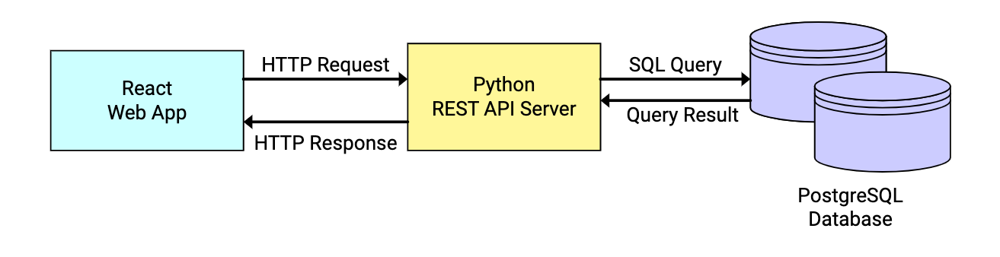

# Project Architecture

## Overview

The entire project can be separated into three main components, similar to how the docker-compose file is constructed:

- [Frontend web app](frontend.md): scripted in Typescript using React library
- [Backend REST API server](backend.md#python-server): scripted in Python
- [PostgreSQL database](backend.md#postgresql)

---

## Ports

Default/Conventional configurations for connection ports have been adopted in this project.

- Frontend app is hosted on PORT 3000.
- REST API server is hosted on PORT 8000.
- PostgreSQL database is hosted on default PORT 5432.

As suggested, REST API server is accepting requests from all origins and ports. Request header is also unrestricted.

---

## Component interaction

All component interactions (except backend server initialisation) begin at React Web App stage. Upon detecting some user activity, frontend app sends a HTTP request to the REST API server on PORT 8000.

The REST API server has no internal cache. Upon receiving a valid HTTP request, the Python server starts connection with the SQL database on PORT 5432, sends a query, and returns a HTTP response after receiving the query result.
